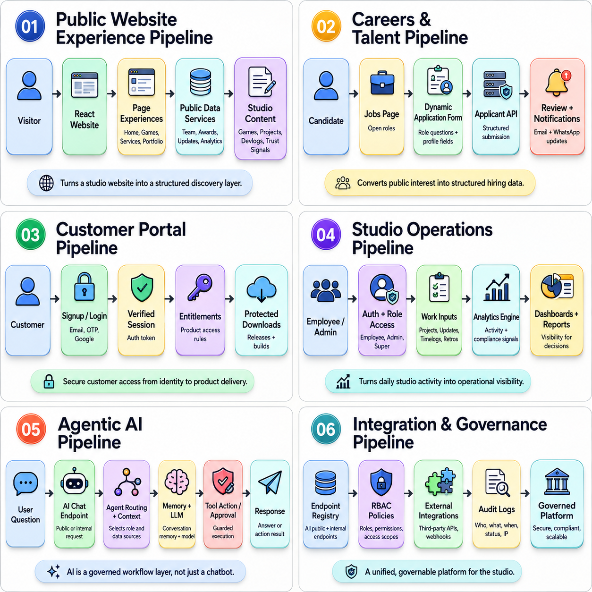
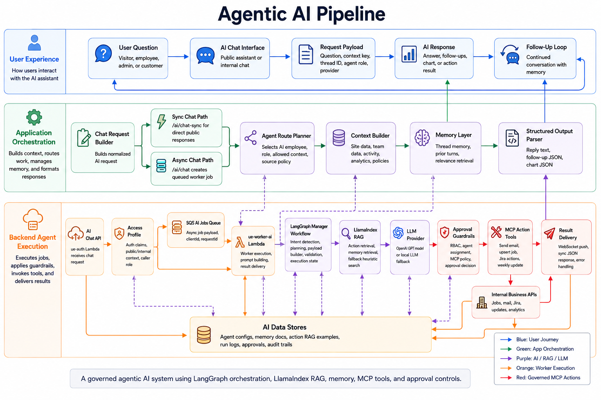
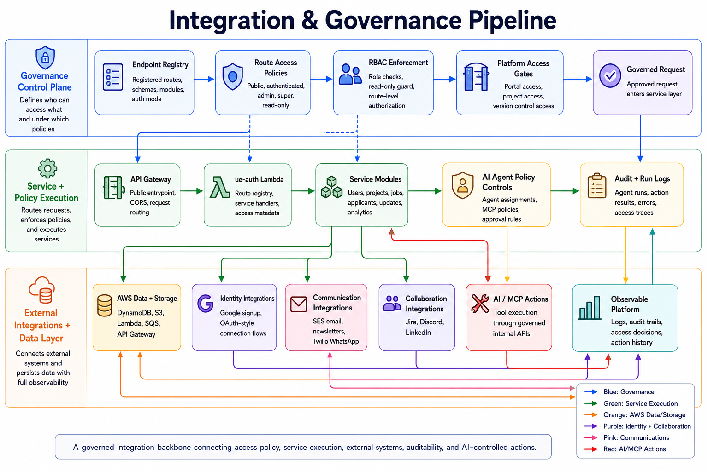

# Fluke Games Digital Studio Platform

This README highlights the core platform architecture behind the Fluke Games web experience. The diagrams frame the project as a connected digital studio platform: public discovery, careers, customer access, operations, agentic AI, and governance.

## Platform Overview



## Core Feature Pipelines

### 1. Public Website Experience Pipeline


### 2. Careers & Talent Pipeline


### 3. Customer Portal Pipeline


### 4. Studio Operations Pipeline


### 5. Agentic AI Pipeline



### 6. Integration & Governance Pipeline



### 7. AWS Deployment + Platform Architecture


## Technology Lens

The platform is designed around a few connected capabilities:

- Public website experiences for games, services, portfolio, team visibility, devlogs, and contact flows.
- Careers and talent workflows that turn public interest into structured applicant data.
- Customer portal access for signup, authentication, entitlements, and protected downloads.
- Studio operations flows for projects, updates, timelogs, analytics, and recognition.
- Agentic AI workflows using routed context, memory, tool actions, and approval guardrails.
- Governance and integrations across endpoint policies, RBAC, audit logs, AWS services, and third-party systems.
- AWS deployment architecture using Lambda, API Gateway, DynamoDB, S3, SQS, SES, Secrets Manager, CloudWatch, IAM/OIDC, and GitHub Actions.

## Local Development

```bash
npm install
npm run dev
```
